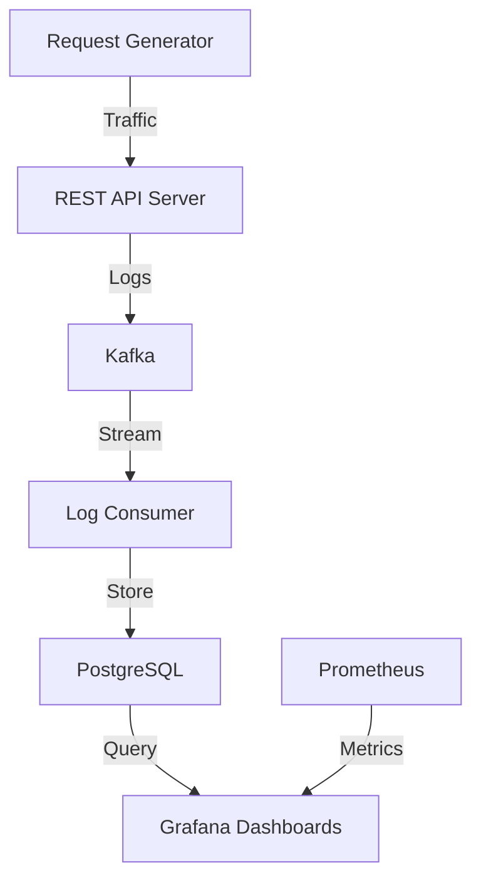

# Application Monitoring Platform

A real-time log analytics platform built with modern containerized technologies for comprehensive API monitoring and visualization.

## 🚀 Overview

This project implements a **Log Analytics Platform** that demonstrates real-time monitoring capabilities for REST APIs. The system ingests logs via Kafka, stores them in PostgreSQL, and visualizes metrics through Grafana dashboards.

## 📊 Architecture



## 🛠️ Technology Stack

| Component | Technology | Purpose |
|-----------|------------|---------|
| **Containerization** | Docker | Service orchestration |
| **Message Broker** | Apache Kafka | Real-time log ingestion |
| **Visualization** | Grafana | Interactive dashboards |
| **Database** | PostgreSQL | Log storage |
| **Monitoring** | Prometheus | Metrics collection |
| **API Server** | FastAPI (Python) | Demo REST API |

## 📋 Features

- **Real-time Monitoring**: Live log ingestion and visualization
- **Request Tracking**: Monitor API calls per endpoint
- **Response Time Analysis**: Track performance trends
- **Error Monitoring**: Identify and visualize frequent errors
- **HTTP Status Distribution**: Monitor success/error rates
- **Customizable Dashboards**: Extensible Grafana visualizations

## 🖥️ Dashboard Metrics

1. **Request Count per Endpoint** - Track API usage patterns
2. **Response Time Trends** - Monitor performance over time
3. **Most Frequent Errors** - Identify problematic areas
4. **Real-Time Logs** - Live log stream
5. **HTTP Status Distribution** - Success/error ratio
6. **API Response Times by Endpoint** - Performance heatmap

## 🚦 Quick Start

### Prerequisites

- Docker and Docker Compose
- Git

### Installation

1. **Clone the repository**
```bash
git clone https://github.com/Thaman-N/AMP
cd application-monitoring
```

2. **Start the services**
```bash
docker-compose up -d
```

3. **Access the dashboard**
- Grafana: http://localhost:3000 (admin/admin)
- API Server: http://localhost:8000
- Prometheus: http://localhost:9090

### Services Startup Order

The services will start in the following order:
1. PostgreSQL Database
2. Kafka Message Broker
3. REST API Server
4. Log Consumer
5. Request Generator (Traffic simulator)
6. Grafana
7. Prometheus

## 🏗️ Project Structure

```
.
├── api/                    # FastAPI server
│   ├── Dockerfile
│   ├── main.py            # REST API implementation
│   └── requirements.txt
├── docker-compose.yml     # Services orchestration
├── grafana/               # Grafana configuration
│   └── provisioning/
│       ├── dashboards/
│       │   ├── api-monitoring.json
│       │   └── dashboards.yml
│       └── datasources/
│           └── datasources.yml
├── kafka/                 # Kafka consumer
│   ├── Dockerfile
│   └── log_consumer.py    # Processes logs to database
├── loggen/                # Traffic generator
│   ├── Dockerfile
│   └── request_generator.py
└── prometheus/            # Prometheus config
    └── prometheus.yml
```

## 📊 API Endpoints

The demo API includes the following endpoints:

- `GET /` - Welcome message
- `GET /health` - Health check
- `GET /todos` - Fetch todos
- `POST /todos` - Create todo
- `GET /users` - Fetch users
- `POST /users` - Create user
- `GET /products` - Fetch products
- `POST /products` - Create product
- `GET /simulate-error` - Trigger errors for testing

## 🔧 Configuration

### Database Schema

The system creates two main tables:
- `api_logs` - Stores API request/response data
- `error_logs` - Stores application errors

### Kafka Topics

- `api-logs` - All API request logs
- `error-logs` - Application error logs

## 🎯 Development

### Adding New Metrics

1. Modify `main.py` to log additional data
2. Update `log_consumer.py` to process new fields
3. Create new Grafana visualizations
4. Add queries in dashboard JSON

### Customizing Dashboards

Edit `grafana/provisioning/dashboards/api-monitoring.json` to modify existing visualizations or add new panels.

## 📈 Monitoring Best Practices

This project demonstrates several monitoring patterns:

1. **Log Aggregation**: Centralized log collection via Kafka
2. **Real-time Processing**: Stream processing for immediate insights
3. **Metric Visualization**: Multi-dimensional data presentation
4. **Error Tracking**: Proactive error monitoring
5. **Performance Monitoring**: Response time tracking

## 🐛 Troubleshooting

### Common Issues

1. **Services not starting**: Check Docker resources and ports
2. **Kafka connection errors**: Ensure network connectivity between containers
3. **Database connection issues**: Verify PostgreSQL is fully initialized
4. **Missing dashboards**: Check Grafana provisioning configuration

### Logs

View service logs:
```bash
docker-compose logs 
```
